# service-app

## Initial page

| 위치권한 화면 | 초기 화면                         | 유저 인포 화면 |
|-------------|---------------------------------|------------------------------------|
|  |  |  |
|위치 권한 설정을 해야 앱을 실행할 수 있습니다.|일반 사용자의 맵 페이지로, 설정버튼을 누르면 계정 정보 페이지로 넘어갑니다. |로그인하거나 회원가입할 수 있습니다.|

## 1. Sign up
| 계정 생성 초기 화면 | 계정 생성 폼                         | 계정 생성 성공   |
|-------------|---------------------------------|------------------------------------|
|  |  |  |

## 2. Sign in
| 로그인 초기 화면 | 로그인 폼                         |
|-------------|---------------------------------|
| 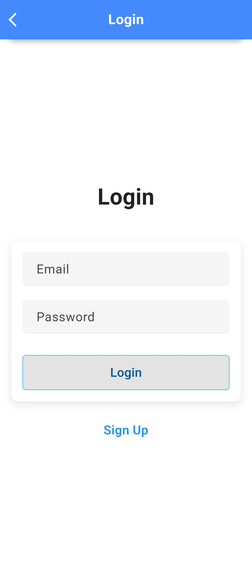 | 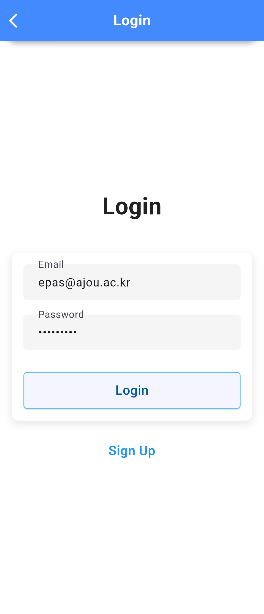 |

## 3. User Info

### 3.1 General User
| 일반사용자 계정 | 응급차량 권한 등록 권한 요청 후      |
|-------------|---------------------------------|
| 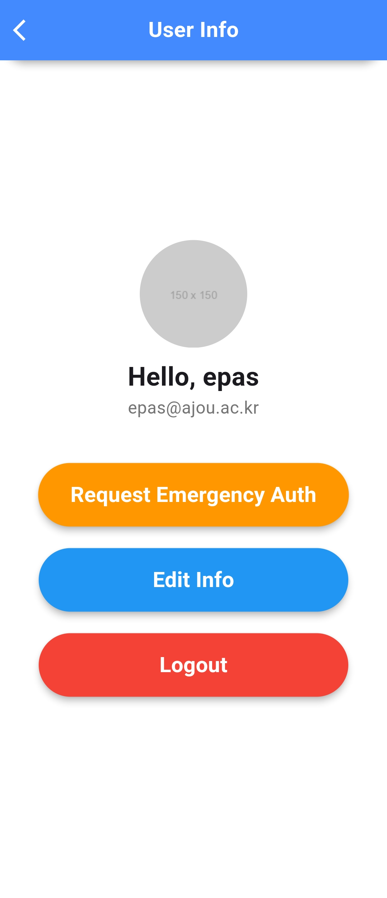 | 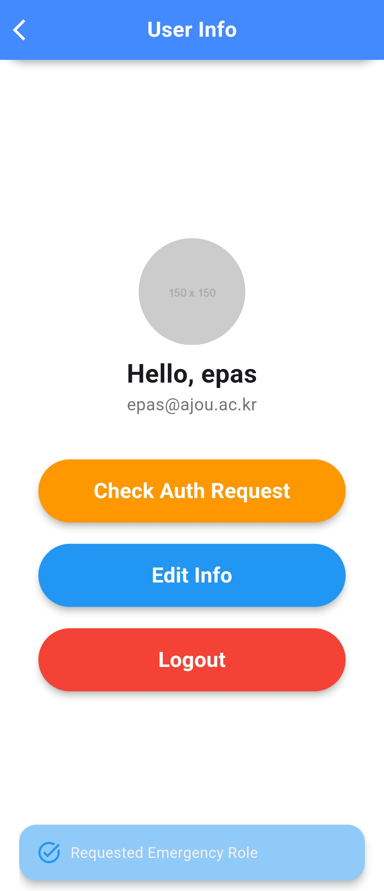 |

> 관리자가 권한을 수락하면, Check Auth Request로 권한이 수정된 것을 확인할 수 있습니다.

### 3.2 Emergency Auth User

| 응급차량 계정 |  
|-------------|
| 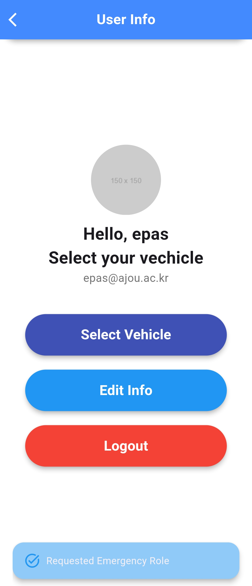 |
> 차량 선택 버튼을 통해 응급 상황으로 등록할 차량을 선택할 수 있다.

| 차량 선택 | 차량 등록 | 차량 등록 성공 |
|-------------|-----------------|---|
| 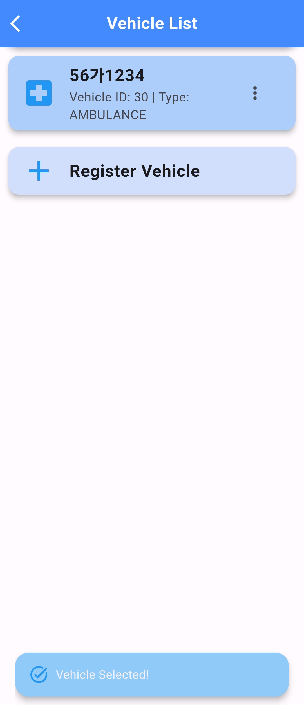 | 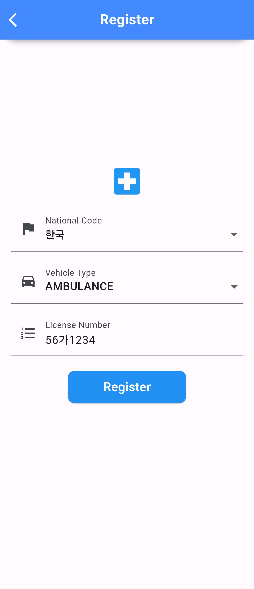 | 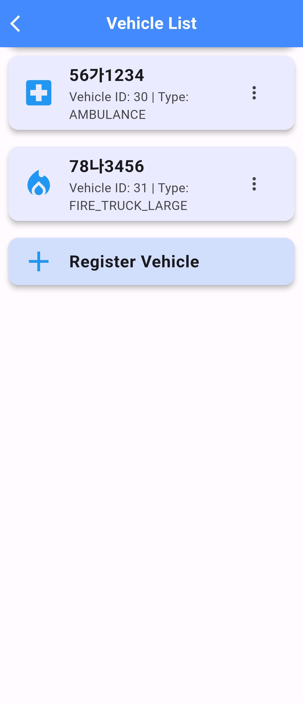 | 

### 3.3 Admin

| 어드민 페이지 |  
|-------------|
| 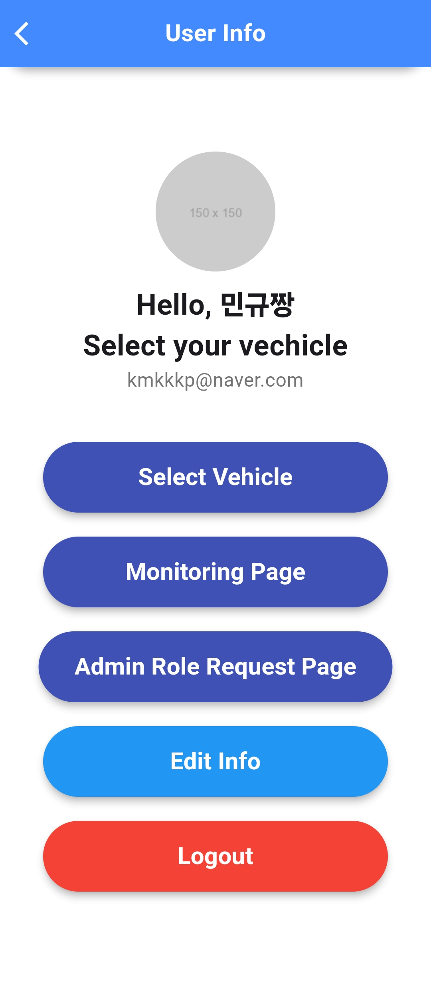 |

#### 3.3.1 Admin Role Request Page

| 권한 관리 페이지 |  
|-------------|
| 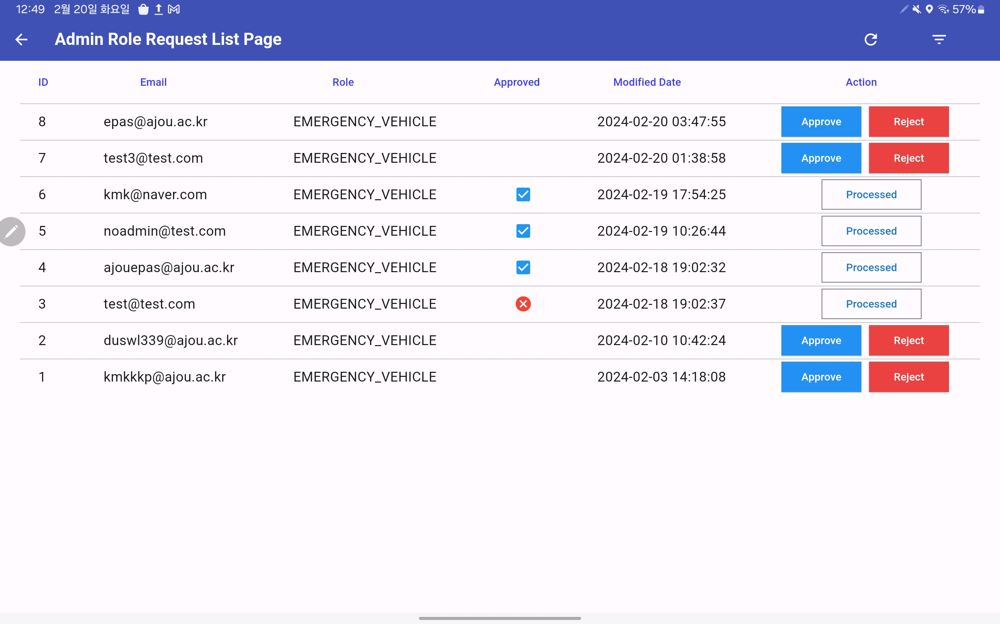 |

#### 3.3.2 Monitoring Page

| 초기화면 |  
|-------------|
| 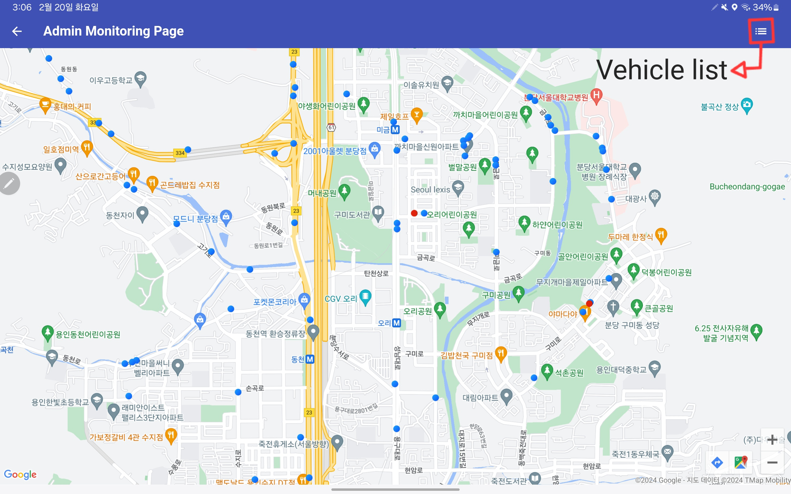 |

| 차량 정보 |  
|-------------|
| 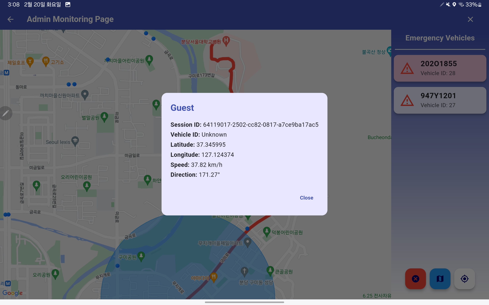 |
> 화면 위에 작은 점들은 차량으로, 점을 누르면 차량 정보가 모달 창이 뜹니다.

| Dots | Explanation |
|------|-------------|
||Emergency Vehicles|
||Not-Alerted Vehicles|
||Alerted Vehicles|

| 긴급차량 별 확인 |  
|-------------|
| 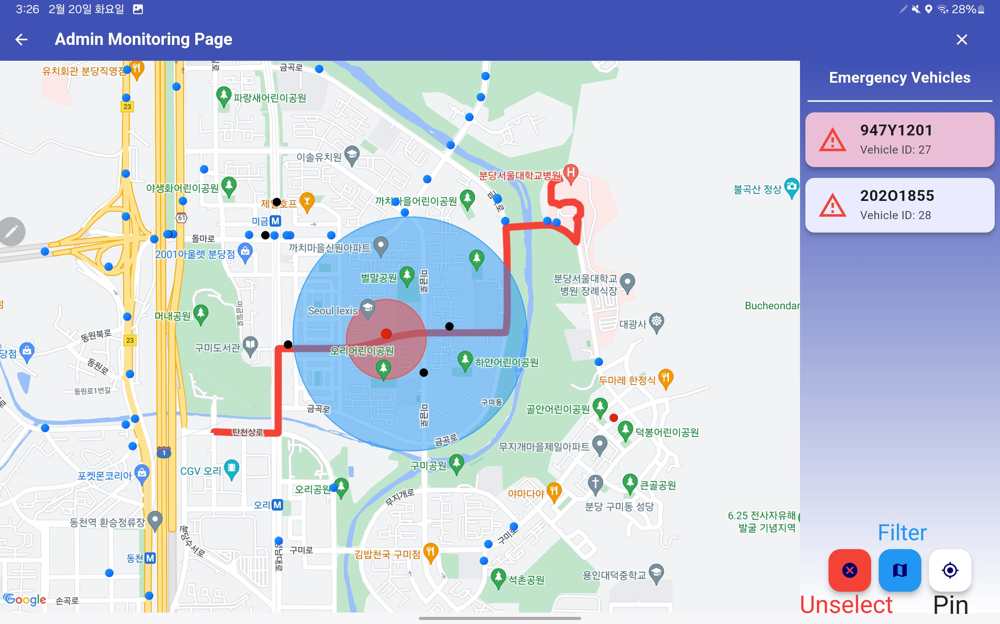 |
> 응급차 별로 경로와 알림 경계를 볼 수 있습니다.  

- `Unselect` 버튼으로 차량 선택 버튼을 취소할 수 있습니다.  
- `Filter` 버튼으로 화면에 표시되는 영역의 범위를 정합니다.  
- `Pin` 버튼으로 선택한 차량을 중심으로 화면을 고정합니다.

## Map Page

> 일반적인 네비게이션 사용법과 동일합니다.

| 초기화면 | 위치 검색 리스트 | 경로 탐색 | 가이드 시작 |네비게이션 종료|
|---|---|---|---|---|
||||||
||원하는 목적지를 선택할 수 있습니다.|||뒤로가기 버튼이나 목적지 30m 부근에 도착하면 가이드를 종료합니다.|

## EPAS

> 일반 차량일 경우, 응급 상황의 알림을 받습니다.

| 첫 알림 확인 | 응급 차량 위치 반영 | 여러 응급 상황 등록 |
| --- | --- | --- |
|  |  |  |

> 응급 차량일 경우, 응급 상황의 알림을 발송할 수 있습니다.

| 초기 화면 | 네비게이션 시작 후 |
| --- | - |
||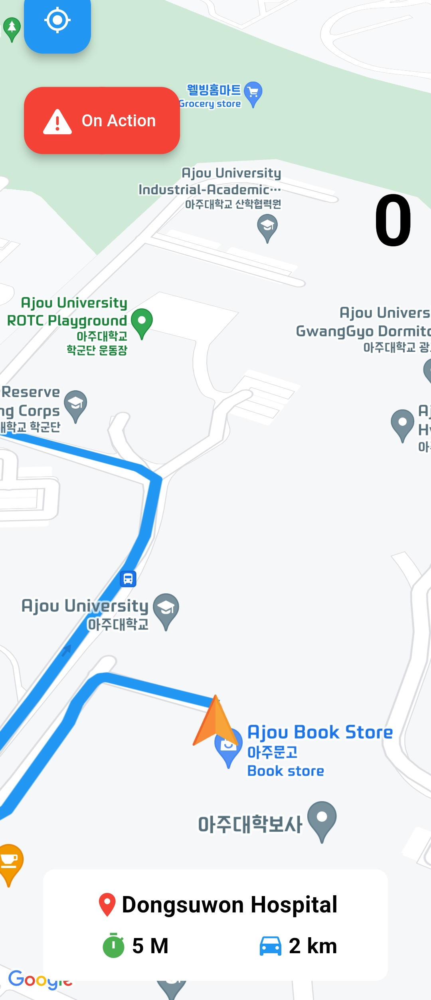|